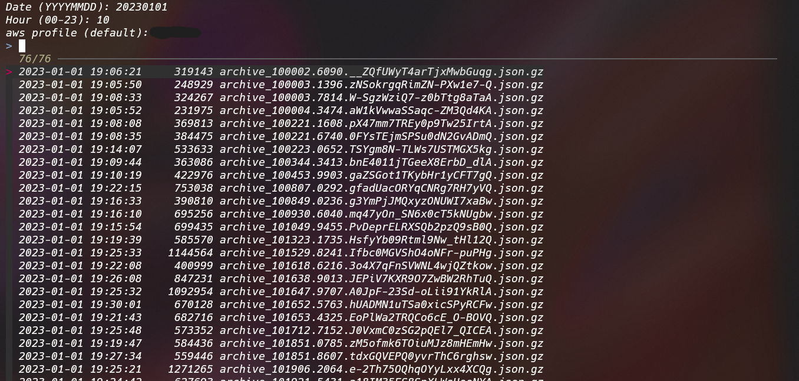

## What is it?


This script revives compressed files(**.json.gz) uploaded on aws s3 by [Datadog's log archiving feature](https://docs.datadoghq.com/logs/log_configuration/archives/?tab=awss3).

[Datadog's Rehydrating from Archives](https://docs.datadoghq.com/logs/log_configuration/rehydrating/?tab=awss3) is expensive. So, the alternative.


## How to use?

Require fzf and gojq

```sh
brew install fzf gojq
```

Then, Rewrite BACKET on the script to your s3 backet name.


### stdout

```sh
> scripts/rehydrate.sh
```



↓ ↓ ↓

```sh
# stdout 
D, [2023-01-01T10:05:49.790847 #1] DEBUG -- : ********************
I, [2023-01-01T10:05:49.781059 #1]  INFO -- : ********************
D, [2023-01-01T10:05:49.914893 #1] DEBUG -- : ********************
D, [2023-01-01T10:05:49.847296 #1] DEBUG -- : ********************
D, [2023-01-01T10:05:49.885009 #1] DEBUG -- : ********************
D, [2023-01-01T10:05:50.707314 #1] DEBUG -- : ********************
D, [2023-01-01T10:05:50.708405 #1] DEBUG -- : ********************
D, [2023-01-01T10:05:50.702667 #1] DEBUG -- : ********************
I, [2023-01-01T10:05:51.470804 #1]  INFO -- : ********************
I, [2023-01-01T10:05:51.517462 #1]  INFO -- : ********************
```

### output hourly logs to file (./logs/YYYYMMDDhh.log)

```sh
> scripts/rehydrate-all.sh
```

## memo


[Format of the archives](https://docs.datadoghq.com/logs/log_configuration/archives/?tab=awss3#format-of-the-archives)

```sh
/my/bucket/prefix/dt=<YYYYMMDD>/hour=<HH>/archive_<HHmmss.SSSS>.<DATADOG_ID>.json.gz
# /my/bucket/prefix/dt=20180515/hour=14/archive_143201.1234.7dq1a9mnSya3bFotoErfxl.json.gz
```
